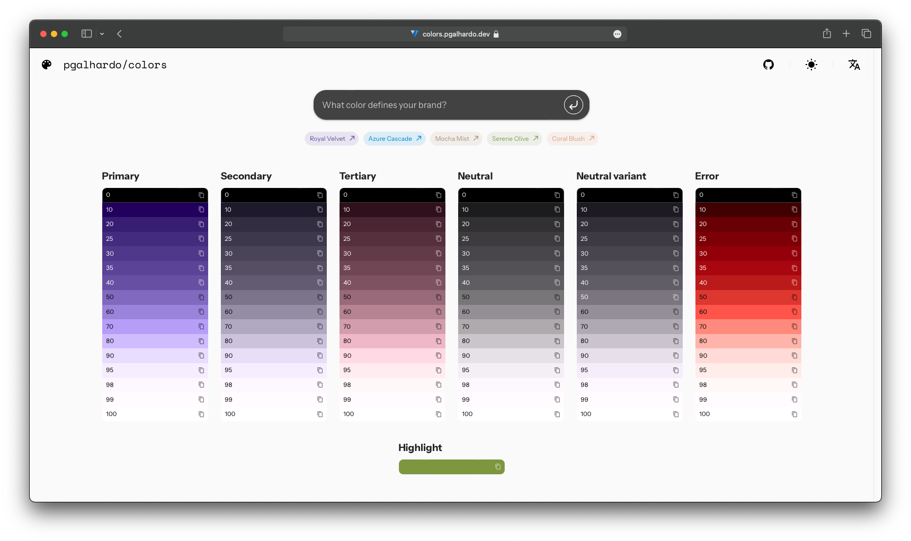
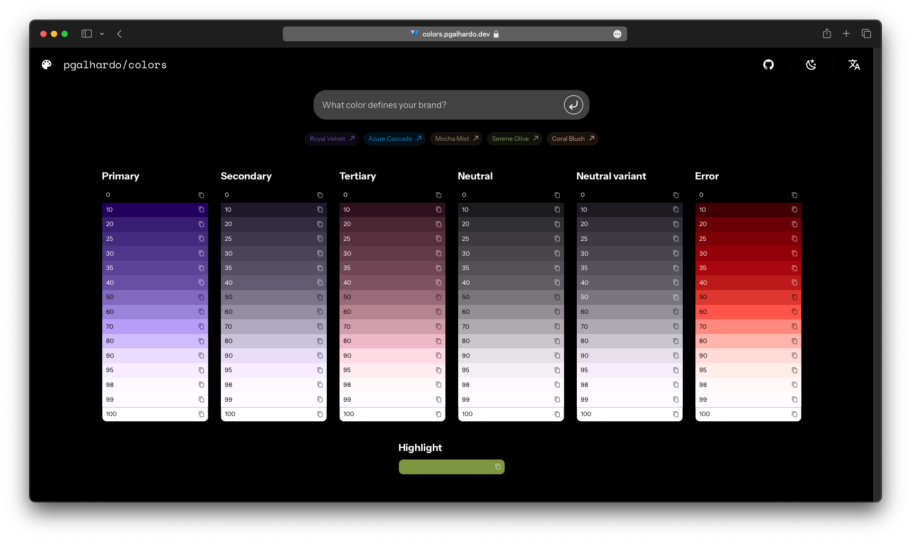

# Vue.js HCT Color Space Utility

A user-friendly tool designed to simplify the process of creating beautiful tonal palettes.
Generate tonal palettes and highlight colors based on your brand color, all powered by Google's HCT Color Space.

## Preview

Check out how the tool looks in both light and dark modes:

### Light Mode



### Dark Mode



## Features

- **Ease of Use**: Input your brand color and get instant color palettes with a harmonized look.
- **Copy to Clipboard**: Quickly copy the generated color values to your clipboard for easy use in your design tools.

## Getting Started

1. Clone this repository:

    ```bash
    git clone https://github.com/pgalhardo/colors.git
    ```

2. Navigate to the project directory:

    ```bash
    cd colors
    ```

3. Install dependencies using PNPM:

    ```bash
    pnpm install
    ```

4. Open your browser and visit [http://localhost:3000](http://localhost:3000).

5. Input your brand color by entering the HEX code.

6. Click the generate button to automatically create tonal palettes and highlight colors.

7. Copy the generated color values directly to your clipboard with a single click.

## License

This project is licensed under the MIT License - see the [LICENSE.md](LICENSE.md) file for details.
